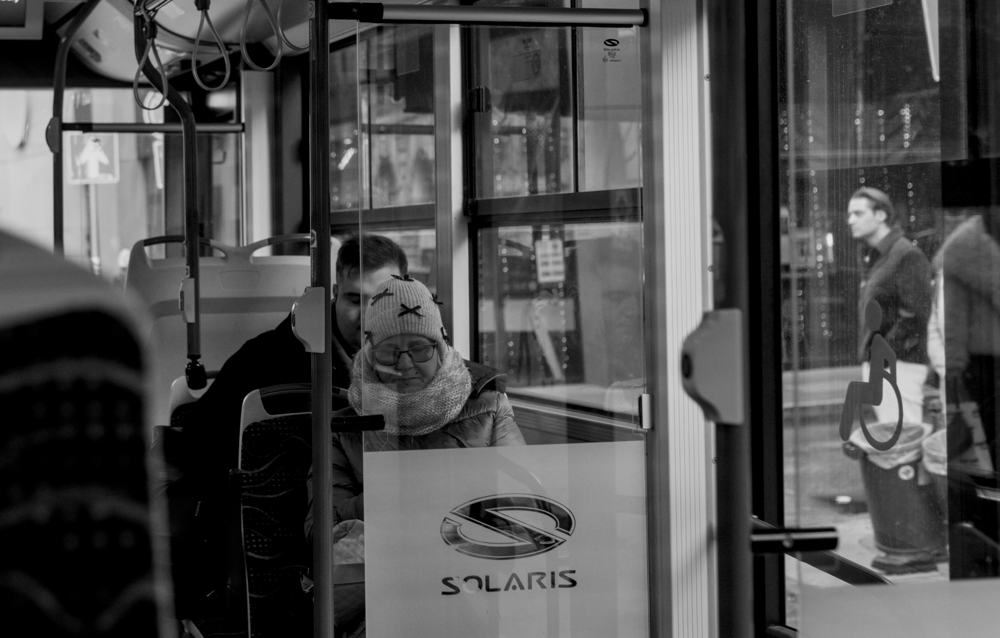

<link rel="stylesheet" href="{{ '/assets/css/custom.css?v=9' | relative_url }}">


---

<section class="section-box">
  
I enjoy capturing moments with my camera. <a class="photo-link no-underline" href="https://www.flickr.com/photos/203606562@N02/">See more of my photos</a>

  

    
    
    
    
    
    
    
    
    
    
    
    
    
    
  

</section>

