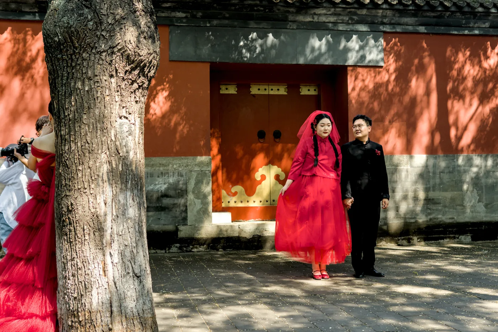

<link rel="stylesheet" href="{{ '/assets/css/custom.css?v=24' | relative_url }}">


---

<section class="section-box">
  <h2 class="section-title" style="text-align: center;">Photography</h2>
  
I enjoy capturing moments with my camera. <a class="photo-link no-underline" href="https://www.flickr.com/photos/203606562@N02/">See more of my photos</a>

  

    
  

  <ul class="sayings-list" style="margin-top: 2rem;">
    <li>"If you look for a meaning, you'll miss everything that happens." — Andrei Tarkovsky</li>
  </ul>
</section>

