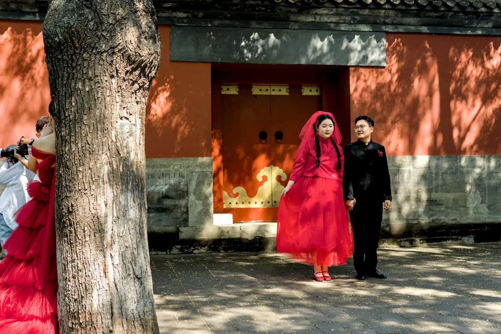

<link rel="stylesheet" href="{{ '/assets/css/custom.css?v=37' | relative_url }}">


---

<section class="section-box personal-section">
  

    Beyond research
    <h2 class="section-title">Photography</h2>
    
I enjoy capturing moments with my camera. <a class="photo-link no-underline" href="https://www.flickr.com/photos/203606562@N02/" target="_blank" rel="noopener">See more of my photos <i class="fas fa-arrow-right" style="font-size:0.72em;"></i></a>

  

  

    

      

        

        <button class="carousel-arrow carousel-prev" type="button" aria-label="Previous photo">
          <i class="fas fa-chevron-left"></i>
        </button>
      

      <figure class="photo-frame">
        
      </figure>

      

        <button class="carousel-arrow carousel-next" type="button" aria-label="Next photo">
          <i class="fas fa-chevron-right"></i>
        </button>
        

      

    

  

  <figure class="pull-quote">
    <blockquote>If you look for a meaning, you'll miss everything that happens.</blockquote>
    <figcaption>— Andrei Tarkovsky</figcaption>
  </figure>
</section>

